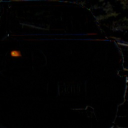
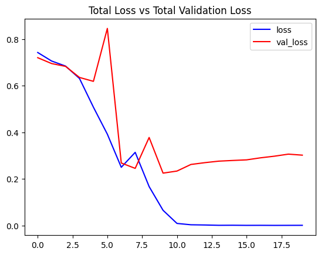
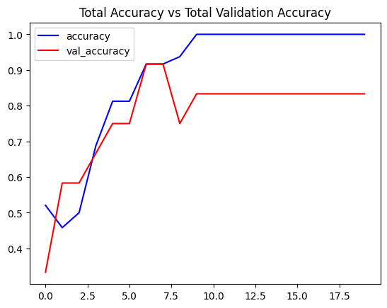

# Turn Light Detection

Deep learning project for detecting vehicle turn signals (left/right) using **LRCN (CNN + LSTM)** with **SIFT Preprocessing**.

## Result Demo

Our model performs robustly on both clean datasets and noisy real-world footage.

### 1. Real-world Testing (YouTube Source)
*Testing on raw dashboard camera footage with moving backgrounds.*


### 2. Dataset Validation
*Testing on the Vehicle Rear Signal Dataset (Standardized environment).*


---

## Overview

Recognizing blinking turn signals is difficult for standard CNNs because the "blinking" feature is temporal, and the car/background is constantly moving.

This project solves it by:
1.  **SIFT Alignment & Subtraction**: We use SIFT (Scale-Invariant Feature Transform) to align the previous frame to the current frame and subtract them. This eliminates the static background, leaving only the changing pixels (the light).
2.  **LRCN Model**: A **Long-term Recurrent Convolutional Network** takes the sequence of subtracted frames to learn the rhythmic pattern of the blink.

## Project Structure

```
turn-light-detection/
├── requirements.txt
├── demo/                 # Result images and logs
├── preprocess.py         # SIFT alignment & subtraction logic
├── train.py              # LRCN Model training
├── predict.py            # Real-time video prediction
├── utils.py              # Shared utility functions (Sorting, Data Loading)
└── README.md
```

## Requirements

- Python 3.8+
- TensorFlow 2.8+
- OpenCV 4.5+ (opencv-contrib-python)

Install dependencies:
```bash
pip install -r requirements.txt
```

## 1. Dataset Preparation

**Critical Step**: regardless of the source, your data **must** follow the directory structure below.

### Final Required Structure
Before running `preprocess.py`, ensure your `data/raw` folder looks like this:

```
data/raw/
├── turn_left/
│   ├── clip_01/      (Contains frames for one complete left turn event)
│   ├── clip_02/      (Contains frames for another left turn event)
│   └── ...
└── turn_right/
    ├── clip_01/      (Contains frames for one complete right turn event)
    └── ...
```

### Step 0: Create Base Directories
First, create the necessary folders to store your data:
```bash
mkdir -p data/raw/turn_left
mkdir -p data/raw/turn_right
```

---

### Option A: Use Public Dataset (Recommended)
The public dataset is already organized by event, but you need to **filter and move** them.

1.  Download the [Vehicle Rear Signal Dataset](http://vllab1.ucmerced.edu/~hhsu22/rear_signal/rear_signal#).
2.  **Filter and Move**:
    *   **Turn Left**: Move all folders ending in **`OLO`** into `data/raw/turn_left/`.
    *   **Turn Right**: Move all folders ending in **`OOR`** into `data/raw/turn_right/`.

### Option B: Custom Dataset

1.  **Extract Frames**: Use FFmpeg to turn video into images.
2.  **Organize**:
    *   Create a sub-folder for each **single turn event** inside `turn_left` or `turn_right`.
    *   **Do not** mix multiple events in one folder.

## 2. Preprocessing (SIFT)

Run the preprocessing script to generate difference frames:

```bash
python preprocess.py
```

**How it works:**
We use SIFT to match features between consecutive frames, align them, and compute the difference.
*Result (Background Removed vs. Active Light):*



## 3. Training

Train the LRCN model. The script uses a **Sliding Window** technique to extract multiple training sequences from your clips, maximizing data usage.

```bash
python train.py
```

**Model Architecture:**
We use a TimeDistributed CNN coupled with LSTM layers.

**Performance:**
The training process typically converges quickly with high accuracy.

| Loss Curve | Accuracy Curve |
| :---: | :---: |
|  |  |

## 4. Prediction

Run the trained model on a video file. The script performs SIFT subtraction in real-time.

```bash
# Make sure to specify your model path
python predict.py --video test_video.mp4 --model models/lrcn_turn_signal_latest.h5
```

## Credits

- Original Concept: [BleedAI Academy](https://bleedaiacademy.com/human-activity-recognition-using-tensorflow-cnn-lstm/)
- Dataset: [Vehicle Rear Signal Dataset](http://vllab1.ucmerced.edu/~hhsu22/rear_signal/rear_signal#)

## License

MIT License
